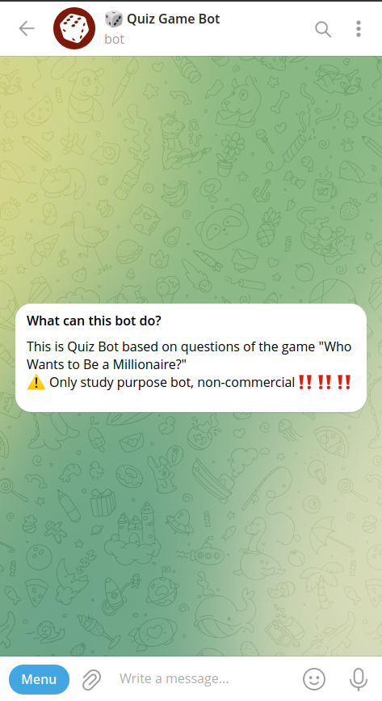
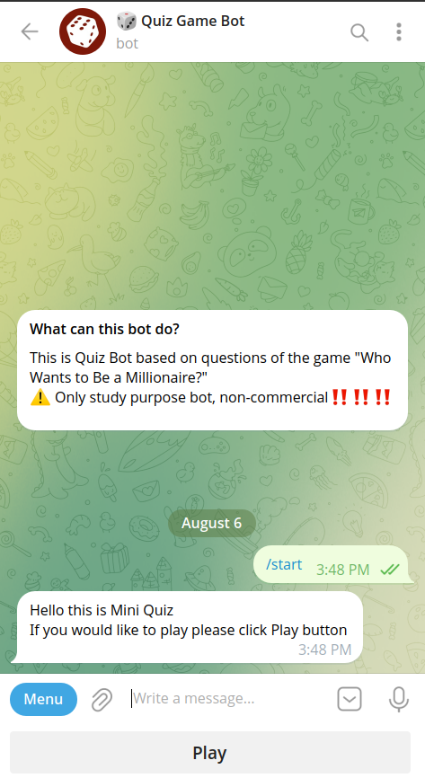
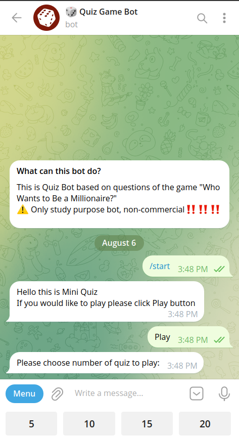
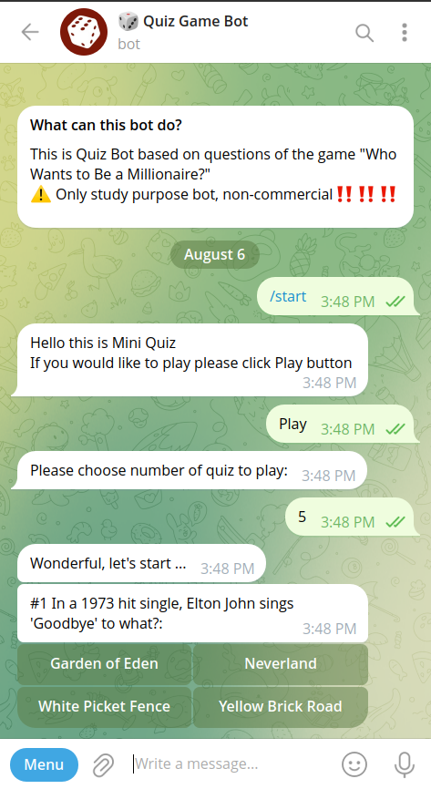
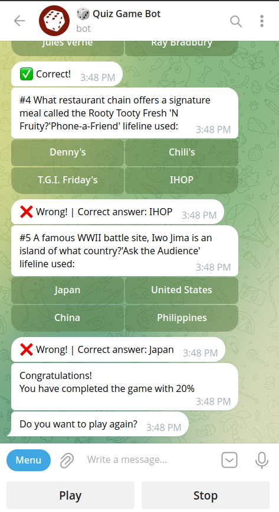
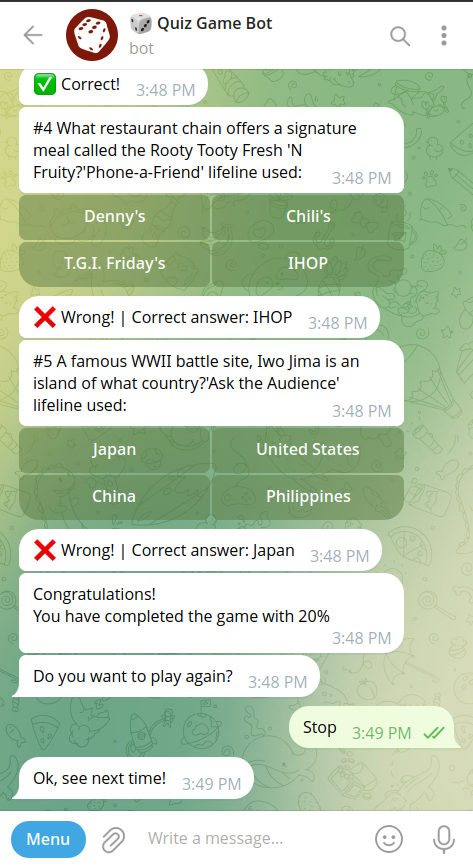

# 🤖 Python Quiz Telegram Bot (aiogram v3)

A fun and interactive **Quiz Bot for Telegram** built using **Python** and **aiogram v3**. Users can play quick multiple-choice quizzes directly in Telegram with instant feedback, scoring, and replay options.

---

## 📸 Bot Preview


### 🟢 Start Command


### ▶️ Choose Number of Questions


### ❓ Quiz Question with Inline Answers


### ✅ Correct / ❌ Wrong Answer Feedback


### 📊 Final Score Summary


---

## 🧠 How It Works

1. User sends `/start` command.
2. Bot responds with a **"Play"** button.
3. User selects number of questions: `[5, 10, 15, 20]`.
4. Quiz starts:
   - Each question is sent as a message.
   - Answer options appear as **inline buttons**.
5. User receives feedback for each answer:
   - ✅ **Correct**
   - ❌ **Wrong** + correct answer
6. After last question:
   - Bot sends **score percentage**
   - Asks: *"Do you want to play again?"* with buttons: `[Play]` | `[Stop]`.

---

## 🚀 Launch Instructions

> ⚠️ **IMPORTANT!!!**  
> Before anything else, create your bot via [@BotFather](https://t.me/BotFather) and copy your **Bot Token** — you'll need it to run the bot!

### 1. Clone the Repository

```bash

git clone https://github.com/yourusername/telegram-quiz-bot.git
cd telegram-quiz-bot
python3 -m venv venv
source venv/bin/activate
pip install -r requirements.txt
python3 ./bot.py

```
